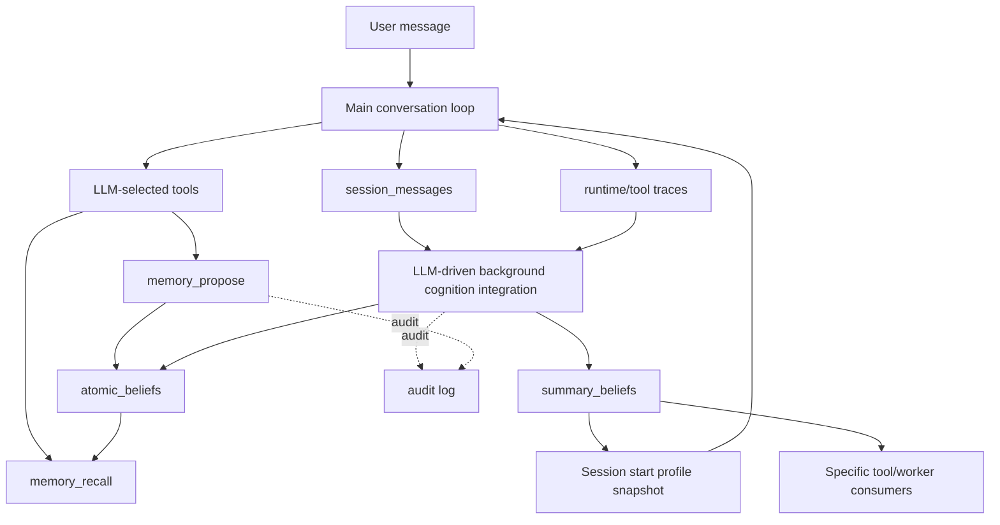

# Cognition/Memory Runtime Service Plan

## Status

Proposed TODO.

## Core Position

The cognition and memory system exists to serve the main conversation loop. It should not create hidden prompt paths, side prompts, or ad hoc reminders that bypass the conversation loop contract.

The only cognition-backed read inputs allowed in the real answer path are:

1. Profile-level memory loaded when a session starts or first binds a counterpart.
2. Memory explicitly recalled by the LLM through `memory_recall`.

The only memory write paths are:

1. LLM-initiated writes through memory tools.
2. Background cognition integration over raw conversation records and existing cognition entities.

Background cognition must be LLM-driven for cognitive semantics. Deterministic code may schedule work, select source windows, validate schemas, enforce safety gates, generate ids, persist cognition entities, maintain indexes, write audit logs, and expire time-bounded records. Deterministic code must not be the source of memory extraction, semantic classification, conflict interpretation, profile synthesis, self-memory synthesis, or domain-guidance synthesis.

The stable foundation must therefore be the `Belief` contract. Background cognition, profile generation, recall, conflict handling, domain guidance, and self-understanding all depend on a coherent belief ontology. The belief model refactor is a prerequisite, not a later cleanup.

## Decisions

- Background cognition uses the same LLM interface and credentials as the foreground runtime. It does not introduce a separate background key.
- Background LLM behavior may be fixture-backed in tests so CI remains deterministic.
- Project identity is derived from raw context by the LLM as a project descriptor. Program logic normalizes that descriptor and generates the project reference id.
- Background LLM budget, cost controls, and rate limiting are deferred. The current plan defines the correctness contract and worker shape first.
- Automatic daemon background execution is a core cognition capability. The target config is `[cognition.background].enabled = true` by default after the LLM-mediated background pipeline is implemented; manual cognition commands remain explicit operator/debug actions.
- Existing database data does not need to be preserved. This plan assumes no live data compatibility requirement.
- Primary cognition state is stored as current cognition entities, not as read models rebuilt from audit logs.
- Atomic and summary beliefs are separate persisted entity types, such as `atomic_beliefs` and `summary_beliefs`, while still belonging to the same `Belief` family.
- Raw `session_messages` and runtime/tool traces are the durable source material for cognition. If cognition must be regenerated, the system reruns LLM-mediated extraction and consolidation from raw sources; it does not replay audit records expecting identical LLM-derived cognition.
- Cognitive/audit logs may be written for debugging, evidence inspection, and operational forensics, but they are not the canonical source of current cognition state.

## Problem Statement

The current implementation already has many cognition structures: audit-style events, materialized views, context windows, legacy L2 guidance records, profile summaries, background summaries, and consolidation workers. The issue is not that these structures do not exist. The issue is that the current implementation exposes a log-derived read-model shape that is not the target cognition model.

The current main answer path uses:

- Runtime system prompt.
- Session history assembled by `SessionContextAssembler`.
- Session profile snapshot when one exists.
- LLM-selected tools, including `memory_recall` and `memory_propose`.

That answer-path shape is fundamentally correct. The improvement should close the missing memory loops around it, not add a fifth hidden input path.

The current belief classification is not stable enough for that architecture. `CognitiveType` mixes content kind, semantic facet, abstraction level, and usage. A core cognition architecture needs orthogonal fields so that memory write, recall, background integration, profile generation, and conflict resolution can all use the same durable contract.

The target cognition model is message-sourced and entity-centered:

```text
session_messages / runtime traces / tool traces
  -> LLM-mediated extraction and consolidation
  -> atomic_beliefs and summary_beliefs
  -> recall, profile snapshots, and domain consumers
```

Audit logs may explain what happened, but they do not define current cognition and are not used as a deterministic rebuild source.

## Design Principles

1. **Belief Contract First**

   Refactor the belief ontology before wiring more background behavior. The system cannot reliably consolidate, recall, summarize, or resolve conflicts if the bottom-level classification is unstable.

2. **No Hidden Cognition Prompt Injection**

   Do not render `CognitionView`, domain guidance summaries, context window background, self-memory summaries, or arbitrary internal cognition state directly into `respond()` prompts. If a state should influence answers, it must become profile-level memory or be available through explicit recall.

3. **Profile Is Session-Start Context**

   Profile-level memory is loaded when a session is initialized or first receives a counterpart. It should be stable during a session. Later background updates may affect future sessions, not mutate the middle of an active conversation.

4. **Recall Is LLM-Directed**

   The runtime should expose high-quality memory recall tools, but it should not silently recall memory before each answer. The model decides when explicit memory lookup is useful.

5. **Background Cognition Is LLM-Driven Integration**

   Background workers orchestrate LLM calls that extract, classify, consolidate, resolve, and summarize memory. Deterministic code provides boundaries and persistence, not cognitive judgment.

6. **Domain Guidance Is Summary Memory**

   Guidance about how a tool, worker, or domain should behave is stored as a `summary_belief`, not as a separate cognition entity. A domain consumer may read applicable summary beliefs and compile them into local behavior, but that compiled behavior is not the canonical cognition state.

7. **One Conversation Contract**

   `debug prompt` and real `respond()` should preview the same prompt contract. If the real answer prompt only includes system, profile snapshot, and session history, debug output should reflect exactly that.

8. **Direct Refactor Toward The Target**

   Do not preserve partial compatibility with the current belief type model. The target ontology should replace the old classification directly.

9. **Entity State First**

   Cognition should be modeled as current belief entities: atomic beliefs and summary beliefs. Search indexes, audit logs, and any compiled runtime controls are implementation support, not cognition concepts. Do not make log replay part of the target architecture.

## Target Architecture



The main loop has only two cognition read points:

- `SessionStart -> Runtime`: profile snapshot.
- `atomic_beliefs -> Recall -> Tools -> Runtime`: explicit tool recall.

All other cognition nodes are internal integration, memory compilation, or domain-control nodes.

## Document Set

Read these files in order when implementing or reviewing this plan:

1. [Belief Ontology](01-belief-ontology.md)
2. [Background LLM Contract](02-background-llm-contract.md)
3. [Runtime Prompt And Memory Paths](03-runtime-memory-contract.md)
4. [Current Implementation Gaps](04-current-gaps.md)
5. [Implementation Phases](05-implementation-phases.md)
6. [Checkpoints, Risks, And Done Definition](06-checkpoints-risks-done.md)
